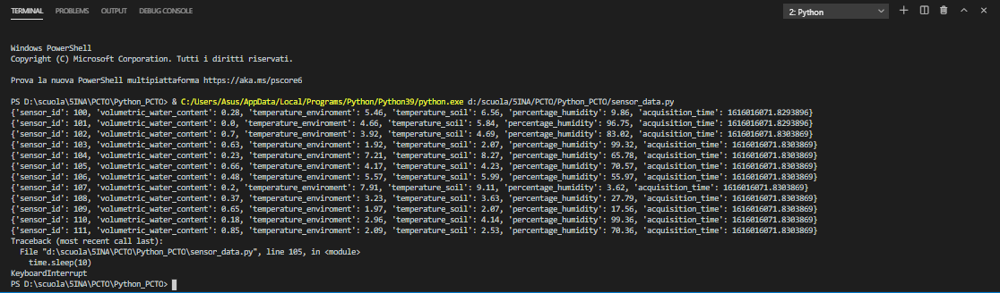

# PCTO2021: Approccio serverless al processamento di dati provenienti da sensori 

## Obiettivi del progetto
> Introduzione


Si vuole simulare un acquisizione di dati da dei sensori di temperatura sparsi in 3 campi diversi.
Utilizzando dei servizi di cloud computing, questi dati vengono inseriti all'interno di un database e mediante Alexa si chiede di estrapolare un dato 


> Una rapida spiegazione di come funziona il nostro programma.


Un codice in python genera in maniera fittizia dei dati quali contenuto volumetrico d'acqua, 
temperatura ambientale, temperatura del suolo e umidità, ma che siano il più possibile realistici e credibili; 
il codice genera i dati ogni x minuti a ciclo continuo.
Queste informazioni vengono poi inserite nel database tramite l'API Gateway 
che richiama la Lambda function apposita che inserisce i dati. 


## Architettura (componenti software/hardware e loro interazione)
```sh
Per la realizzazione del progetto è stato utilizzato:
-**DBeaver**:è uno strumento di amministrazione del database, che ci permette di gestire il db creato da AWS
-**Visual Studio Code - Python(3.9.1)**: in python viene scritto il codice che genera i dati dei nodi e invia il JSON all'API Gateway
-**Alexa Developer**: mediante Alexa viene fatta una richiesta e la Lambda restituisce il risultato
-**AWS (Amazon Web Services)**: offre dei servizi di cloud computing, quelli utilizzati sono:

  -API Gateway: questa interfaccia richiama le Lambda function in base alle HTTP request.

  -Lambda function:    vengono utilizzate due lambda function, entrambe in linguaggio python, ma con metodi diversi:
        1. metodo POST: si connette al database
        2. metodo GET:  esetrapola dei dati dal database e li restituisce in JSON

  -RDS (Relational Database Service): viene creato un database PostgreSQL che, una volta configurato, viene gestito da DBeaver 

```


### Elenco dei tool che utilizzate (non deve essere un tutorial, piuttosto usate link esterni)
```sh

API Gateway: https://console.aws.amazon.com/apigateway/home?region=us-east-1#/apis/gcm2ijz2qa/resources/uil15qngw1
Alexa Developer: https://developer.amazon.com/it-IT/alexa

```

## Simulazione in Python dei dati necessari all'applicazione



## Struttura del database: schema ER e schema logico, eventuali vincoli di integrità referenziale
## Lambda function per il data injection e per l’elaborazione dei dati nel database
```sh

Una prima lambda function è necessaria per inserire i dati presenti nei diversi nodi ed inserirli all'interno del database attraverso una query.

query = "INSERT INTO sensor_values(sensor_id, volumetric_water_content, temperature_enviroment, temperature_soil, percentage_humidity, acquisition_time) VALUES (%s, %s, %s, %s, %s, %s);"
    query_request = (sensor_id, volumetric_water_content, temperature_enviroment, temperature_soil, percentage_humidity, acquisition_time)
    cur.execute(query, query_request)
    conn.commit()
    cur.close()
    conn.close()


Viene utilizzata un'altra lambda function in linguaggio Python che dopo essersi connessa al database fa una query dei dati e che ne estrae il minimo, il massimo e la media.

query = "SELECT MIN(volumetric_water_content), MAX(volumetric_water_content), AVG(volumetric_water_content) FROM sensor_values INNER JOIN sensor_data ON sensor_values.sensor_id = sensor_data.sensor_id WHERE sensor_data.field = "+ str(field) +" AND sensor_values.acquisition_time BETWEEN "+ str(minutes) +" AND " + str(time_now) +" ;"
    cur.execute(query)
    result = cur.fetchall()
    conn.commit()

```
## Spiegate il ruolo del HTTP
```sh
Le HTTP request sono fondamentali per l'interazione fra l'API e il codice.
La request contiene il metodo utilizzato per la richiesta, la URL associata e l'header e il payload; la prima request utilizza il metodo POST per inviare il JSON contenente i dati dei nodi, all'API perciò il payload dovrà contenere la struttura del JSON che dovrà essere compilata dalla lambda function.
Una volta inseriti i dati all'interno del database, verrà effettuata un'altra richiesta da Alexa che richiederà il minimo, il massimo o la media di un dato in base a due parametri (slot), "field" e "n minuti".
La request utilizzerà stavolta il metodo GET passando nel payload questi due parametri e la lambda function risponderà restituendo il JSON con tutte le statistiche di quel dato.

```

## Stato di avanzamento del progetto e sviluppi futuri
> Un rapido resoconto dei risultati ottenuti fino ad ora.


* 0.2.1 (Mar 23 Feb 2021)
    * Continuazione redazione file README
    * Prima revisione dei risultati ottenuti
    
* 0.2.0 (Lun 22 Feb 2021)
    * Continuazione dell'implementazione della funzione lambda al programma in python
    * Inizio redazione file README
    
* 0.1.1 (Gio 18 Feb 2021)
    * Continuazione del lavoro su python per connettere al database
    * Sviluppo funzione lambda e tentativi di implementazione in python
    
* 0.1.0 (Mar 16 Feb 2021)
    * Creazione struttura database con due tabelle
    * Inizio programmazione file python con lista json delle varie città.
    
* 0.0.1 (Lun 15 Feb 2021)
    * Inizio lavoro, divisione del lavoro ed organizzazione responsabilità
    * Creazione dei vari account: postman, github, aws.
    * 
## Considerazioni finali

## Il gruppo di lavoro
> Elenco di presentazione dei membri che partecipano attivamente alla creazione del programma.


- **Contigiani Roberto** (_referente gruppo_): parte dello sviluppo codice e connessione al relativo database;
- **Sgalippa Stefano**: parte relativa allo sviluppo del database;
- **Capparelli Claudio**: parte relativa alla creazione e gestione della pagina GitHub, creazione del file README.md


## Sezione relativa agli sviluppi su Amazon AWS

![Amazon AWS]


## Link che hanno aiutato alla realizzazione del progetto

1. 
